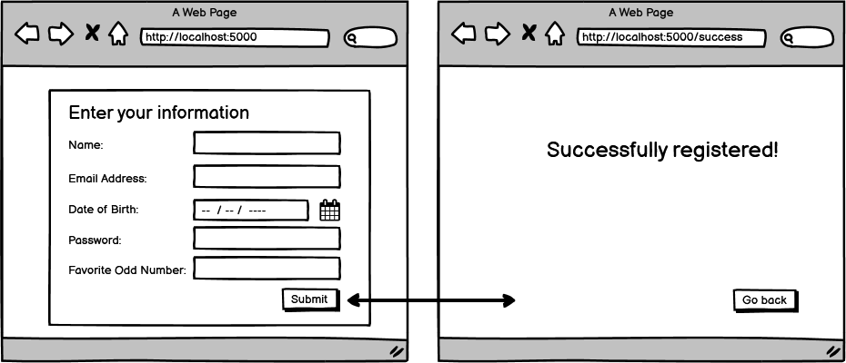

# Practice Assignment: Form Submission

### Learning Objectives:

- Apply form validations in an MVC application using Data Annotations and Models.
- Generate and render error messages that must be resolved to complete a post request.

## Directions
It's time to test everything you've learned about forms! Use the wireframe as a reference to build a form that uses a model, has validations, and renders data using ViewModel.

Some of the validations we will ask you to use are built-in, and some will need to be created. This assignment is designed to challenge you to think critically about how you would validate something, not just to be able to copy/paste built-in validations.

You have been shown all the basic tools you need to complete this assignment, but don't be afraid to do a little research or discuss with your classmates how they went about solving some of these problems.

## Requirements:

Use the checklist below to check that you added all the validations you need:

- All fields are required.
- Name must be at least 2 characters long.
- Email Address must be a valid format.
- Date of Birth must be in the past.
- Password must be at least 8 characters long.
- Favorite Odd Number must be a whole odd number.
- Bonus: update Favorite Odd Number to be Favorite Prime Number (this will take research!)