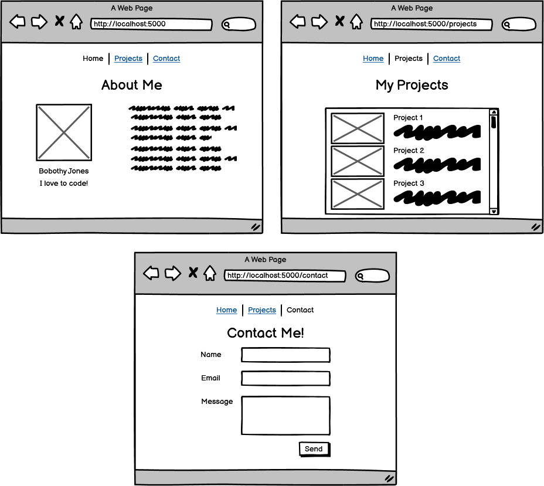

# Practice Assignment: Portfolio II

### Learning Objectives:

- Build upon an existing project to add Views.
- Create Views using pre-existing HTML and CSS knowledge.

## Directions
Use the previous Portfolio I assignment and update it to:

1. Return Views instead of strings.
2. Practice what you know about HTML and CSS to build an interesting website.
3. Add a navigation bar at the top that links to each of the pages.

Remember that these wireframes exist to give you a rough outline. Feel free to get creative and personalize it!

## Requirements:
- Update your 3 routes to return Views instead of strings.
- Add a navbar with links to each page at the top.
- The Home page should have a picture, name, and about me section.
- The Projects page should have at least 3 projects, each with a title, image, and small description.
- The Contact page should have a form requesting the user's name, email, and a message (this form does not need to function).
- Add CSS styling!
- Bonus: Add some JavaScript for a more interactive user experience.