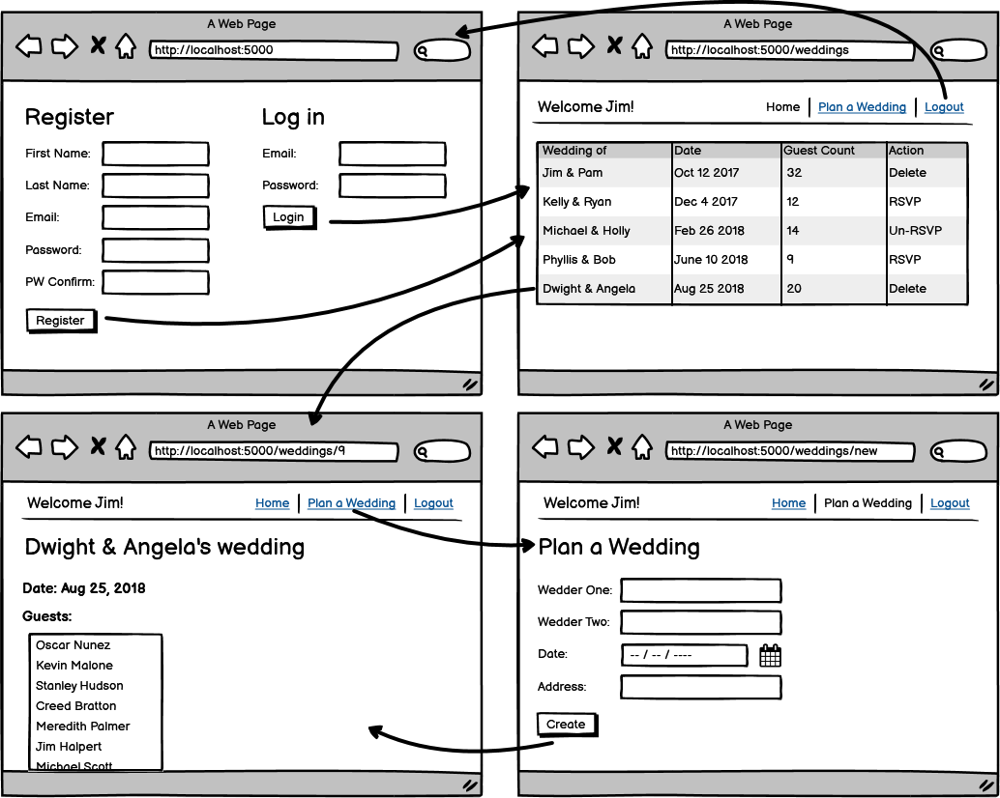

# Core Assignment: Wedding Planner

### Learning Objectives:

- Connect login and registration to an application that depends on a logged-in user.
- Build a database that contains one-to-many and many-to-many relationships between multiple tables.
- Implement session for user authentication.
- Apply logic to determine what a user is able to see based on relational data.

## Directions
Create a web application that allows registered users to plan a wedding. Users can RSVP to weddings and view attendee lists.

### Registration validations

- All fields must be present
- Email must be a valid email format
- Email must be unique
- Password must be at least 8 characters
- Password Confirm must match Password

### Wedding validations

- All fields must be present
- Wedding date must be in the future
- Note: The wedding created is NOT between two users

### User authentication

- Only logged-in users should have access to view any pages beyond the login/register page
- Anyone who is not logged in and who attempts to access any other pages should be redirected to the login page

### Dashboard

- Users can delete a wedding if they created it
- Users can RSVP to a wedding they are not currently attending
- Users can Un-RSVP from a wedding they are currently attending

### Routing

- Ensure all routes (both seen and unseen by the client) follow RESTful routing conventions

## Requirements:

- Able to successfully log in and register.
- All weddings are displayed with accurate guest and action options for users.
- User can create weddings.
- User can view wedding information including a guest list of users attending.
- Session is used to validate login credentials.
- All validations met.

