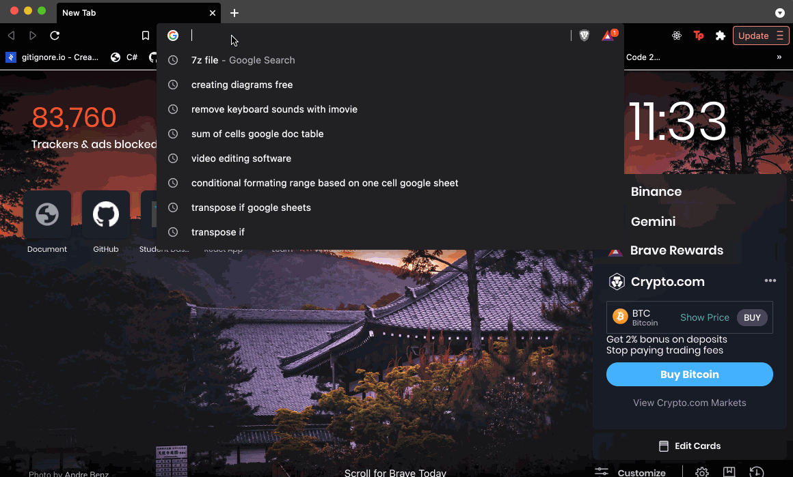

# Assignment: HTML Table

**Welcome to another Core assignment!** Some students like to explore the assignments before they're finished reading through the lessons, and that's okay! It can be good for your brain to have a preview of what your future challenges might be. However, before you begin this assignment, it's important that you've first:

- Completed the preceding lesson modules
- Taken the knowledge checks to confirm your understanding
- Viewed lecture material related to the assignment topics
- Completed and submitted your practice assignments

## Now, the Assignment:


Getting comfortable with iterating through a list of dictionaries is very important for all web development! Records returned from a database will almost always be in this format.

Create the following list of dictionaries and have it available for your route.
```
users = [
   {'first_name' : 'Michael', 'last_name' : 'Choi'},
   {'first_name' : 'John', 'last_name' : 'Supsupin'},
   {'first_name' : 'Mark', 'last_name' : 'Guillen'},
   {'first_name' : 'KB', 'last_name' : 'Tonel'}
]
```
Pass users to your template and have your template output an HTML table like this:

```
First Name	Last Name	Full Name
Michael	Choi	Michael Choi
John	Supsupin	John Supsupin
Mark	Guillen	Mark Guillen
```

As you need to get into the habit of making your assignment look nice, we challenge you to use either [Bootstrap](https://getbootstrap.com/) or [Foundation](https://get.foundation/). If you haven't dabbled with these frameworks, start by learning just enough to do this assignment (creating a nice looking table).

## Requirements:

- Start a new Flask project
- Create a route in which the data above is declared and then sent to the template engine to be rendered
- Create the template that displays the data in a table
- NINJA BONUS: Use a framework to format the table

