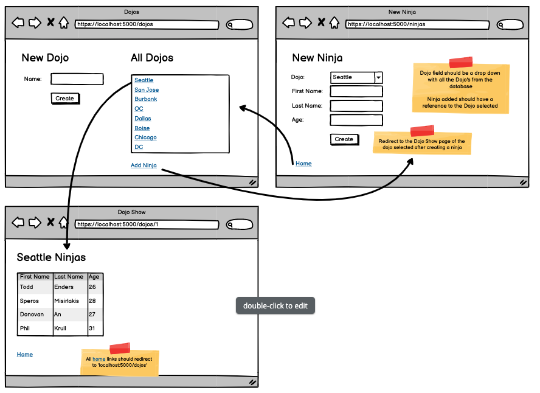

# Dojos and Ninjas CRUD
**Learning Objectives:**

- Connect Flask to a database
- Implement one-to-many relationships in a full-stack Flask application.
    - Use SQL joins to query the database for a record, including its associated records in a one-to-many relationship
    - Build a method that constructs an object representation of a record with a one-to-many relationship including a list of the associated records from the other table.
- Create one-to-many relationships in the database using user input
Pass id data appropriately to and from the client in order to create a foreign key relationships on creation of a new record with a one-to-many relationship.
- Encounter and resolve common Flask development errors using both Flask error messages as well as terminal output from the `mysqlconnection` file, utilizing print statements.

## Now, the Assignment:
**Pro Tip:** Be sure to test each individual feature before you move on to the next one. It may help to write down which feature you are working on and record any bugs you come across and how you solved it for later reference.

## requirements:
- Create a new Flask project
- Use dojos_and_ninjas_schema created in MySQL course
- `Dojo` page to add a new Dojo and display all Dojos
- The dojo links on the `Dojo` page should redirect the `Dojo Show` page
- `Ninja` page to add a new Ninja
- `Ninja` page should include a drop down menu will all of the dojos in the database
- Redirect to the `Dojo Show` page of the dojo selected after creating a ninja
- `Dojo Show` page should display all the Ninjas who are added to the Dojo
- All Home links should redirect to `localhost:5000/dojos`

