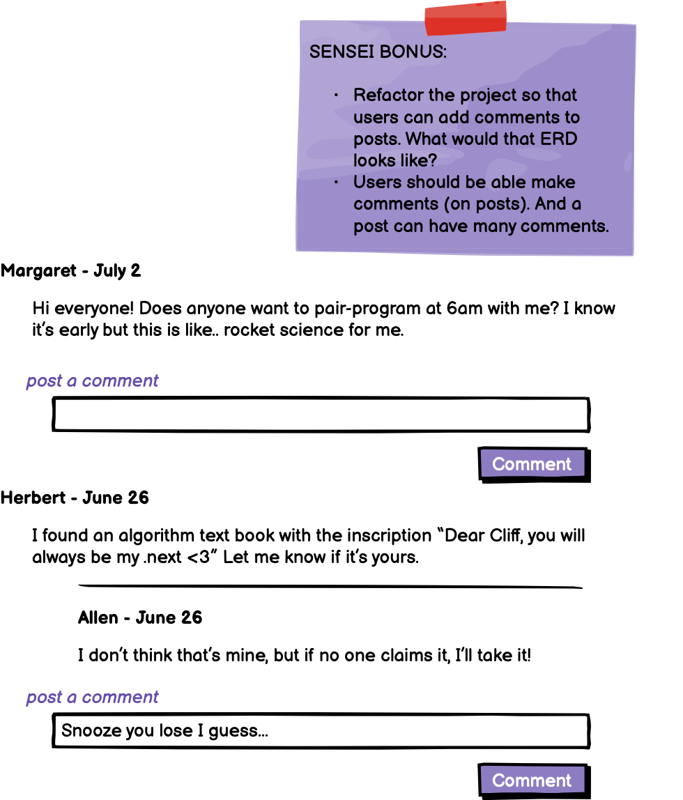

# Assignment: Coding Dojo Wall
**Learning Objectives:**

- Connect a Flask application to a MySQL database.
- Create login and registration within an app.
- Handle a one-to-many relationship that involves users.
- Manipulate and filter data using user ids

Create a wall/forum page where users will be able to post a message and see the message displayed by other users. Store the posted messages in a table called 'posts' and retrieve the posts from the database. Follow the below wireframe.

1. Create a login and registration page that is displayed when a user navigates to 'localhost:5000/'

2. Once the user has logged in successfully redirect them to 'localhost:5000/wall' that will show the wall.

Download the [handout](https://assets.codingdojo.com/boomyeah2015/codingdojo/curriculum/content/chapter/1657832382__The_Wall_22.png) (no bonus) and/or [bonus](https://assets.codingdojo.com/boomyeah2015/codingdojo/curriculum/content/chapter/1657832505__the_wall_comments_bonus.png) here for the wireframe/ERD:

SENSEI BONUS: Once you get the messages to show up, allow users to post comments for any message. Store the replies/comments to the message in a separate table called 'comments'.

Helpful tip from our founder: (Video on the platform)

## Requirements:

- Create a completed login & registration
- Create a clickable prototype (clickable template) with forms and other elements for the wall page
- Create the ERD and forward engineer. (Note: for the sensei bonus, it may look different from the example)
- Modularize the project and create the models
- Strategize first - then add all the routes in your controller. First add render routes, then the post routes and other action/processing routes like delete and log out
- Work one feature at a time: create functionality, displaying all posts, delete, logout etc.
- Finally, add validations
- SENSEI BONUS (Optional): Add the ability to comment on posts.

