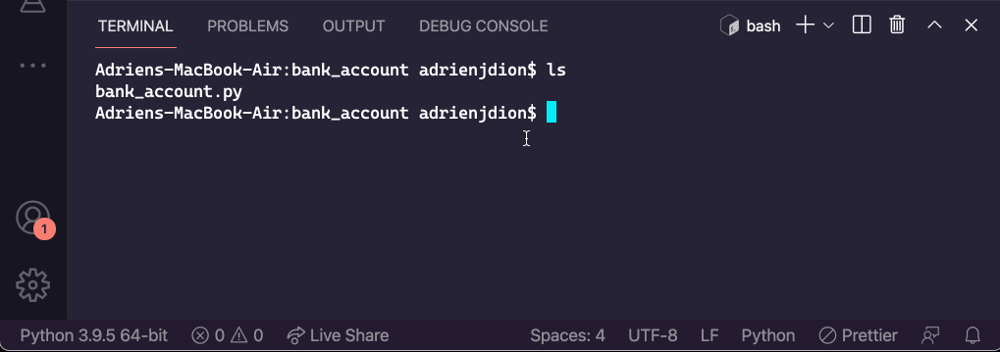

# Assignment: BankAccount
**Learning Objectives:**

- Follow specifications and Python conventions for creating a class
- Implement default arguments in parameters for attributes that can be assigned on instantiation
- Use basic programmatic logic to implement the functionality of a bank account
- Handle edge-cases, such as insufficient funds, with the appropriate control structure (if-else, code flow, or early exit)
- Create and update attributes of an object instance from within the class using self
- Return the object instance (self) in methods and test by chaining method calls
- Test the functionality of your class by creating instances and calling methods with different test data and scenarios


If you imagine a banking system, and how the data is modeled, you may think, well, everything should be tied to the customer, in other words, the user. But users have accounts, and accounts have balances. This gives us the idea that maybe an account is its own class apart from the user class. But as we stated, it is not completely independent of the User class; accounts only exist because users open them.

For this assignment, don't worry about putting any user information in the BankAccount class. We'll take care of that in the next lesson!

Let's first just get some more practice writing classes by writing a new BankAccount class.

The BankAccount class should have a balance. When a new BankAccount instance is created, if an amount is given, the balance of the account should initially be set to that amount; otherwise, the balance should start at $0. The account should also have an interest rate in decimal format. For example, a 1% interest rate would be saved as 0.01. The interest rate should be provided upon instantiation. (Hint: when using default values in parameters, the order of parameters matters!)

The class should also have the following methods:

- deposit(self, amount) - increases the account balance by the given amount
- withdraw(self, amount) - decreases the account balance by the given amount if there are sufficient funds; if there is not enough money, print a message "Insufficient funds: Charging a $5 fee" and deduct $5
- display_account_info(self) - print to the console: eg. "Balance: $100"
- yield_interest(self) - increases the account balance by the current balance * the interest rate (as long as the balance is positive)

This means we need a class that looks something like this:
```
class BankAccount:
    # don't forget to add some default values for these parameters!
    def __init__(self, int_rate, balance): 
        # your code here! (remember, instance attributes go here)
        # don't worry about user info here; we'll involve the User class soon
    def deposit(self, amount):
        # your code here
    def withdraw(self, amount):
        # your code here
    def display_account_info(self):
        # your code here
    def yield_interest(self):
        # your code here
```


### Self Assessment
Before you submit, use the chart below just before you submit to see what skills you have leveled up in, and where you need some extra practice or help.

**Important:** Turn in what you have, and turn in what you were able to build on your own.

You will receive feedback on this and other key assignments, and will be able to re-submit after you revise, so use it as an opportunity to reflect and adjust. Be sure to turn in what you have by the due date, even if it doesn't all work yet, or if you fall short in a few areas or got stuck. It's important to submit your own work as is so that we, but more importantly, you can determine where you need guidance.


## Requirements:
- Create a BankAccount class with the attributes interest rate and balance
- Add a deposit method to the BankAccount class
- Add a withdraw method to the BankAccount class
- Add a display_account_info method to the BankAccount class
- Add a yield_interest method to the BankAccount class
- Create 2 accounts
- To the first account, make 3 deposits and 1 withdrawal, then yield interest and display the account's info all in one line of code (i.e. chaining)
- To the second account, make 2 deposits and 4 withdrawals, then yield interest and display the account's info all in one line of code (i.e. chaining)

**NINJA BONUS:** use a classmethod to print all instances of a Bank Account's info