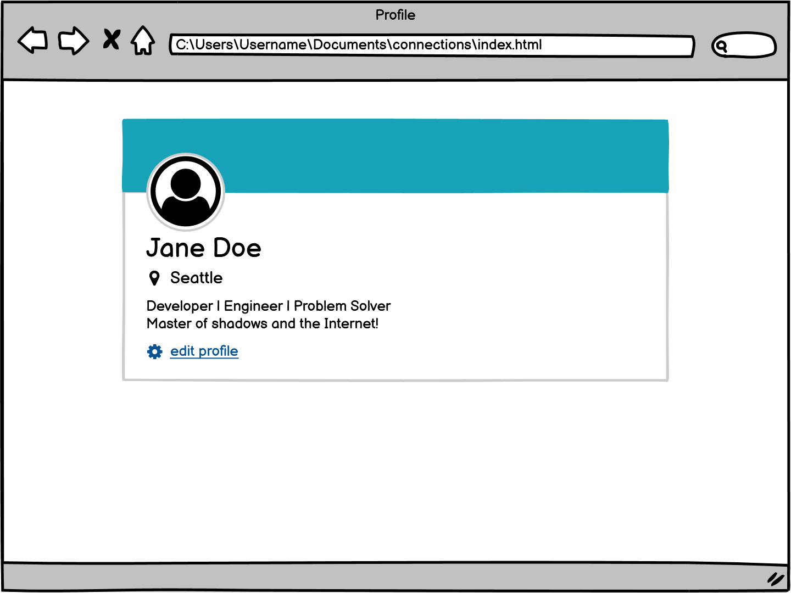

# User Card Layout Assignment

## Overview

This assignment focuses on building a user card component with CSS, replicating the layout provided in the wireframe image. We will apply CSS properties such as `position`, `padding`, and `margin` to style the card and place elements, including icons, accurately.

## Objectives

The primary objectives of this assignment are:
1. **CSS Layout Styling** - Use CSS properties to create a clean, responsive layout for the user card.
2. **Positioning** - Use `position` properties like `absolute`, `relative`, or `fixed` to position the icon as shown in the wireframe.
3. **Spacing** - Use properties like `padding` and `margin` to achieve proper spacing between elements.

**Use what we've learned about CSS to recreate this layout**


## Getting Started

To start this project:
1. Create a project folder.
2. Inside this folder, add an `index.html` file and a `styles.css` file.
3. Link your CSS file to your HTML file and set up the structure following the wireframe.

### Project Structure
user-card-layout/ │ ├── index.html # HTML structure for the user card ├── styles.css # CSS styling for the user card └── README.md # Project README file


#### HTML Structure

In your `index.html` file, create a basic structure for the user card with sections for the user image, user name, and details. Here’s an example:

```html
<!DOCTYPE html>
<html lang="en">
<head>
    <meta charset="UTF-8">
    <meta name="viewport" content="width=device-width, initial-scale=1.0">
    <title>User Card Layout</title>
    <link rel="stylesheet" href="styles.css">
</head>
<body>
    <div class="user-card">
        <div class="icon">
            <!-- Icon image -->
            
        </div>
        <div class="user-info">
            <h2>John Doe</h2>
            <p>Software Engineer</p>
        </div>
    </div>
</body>
</html>
```

#### CSS Styling
In your `styles.css` file, add styling to achieve the look and layout required:

Style the `.user-card` container to have a background, padding, and border radius.
Use `position` properties to position the icon correctly within the card.
Add spacing and alignment to elements to match the design. 

